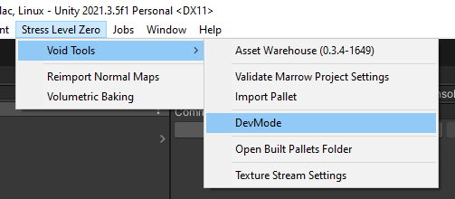
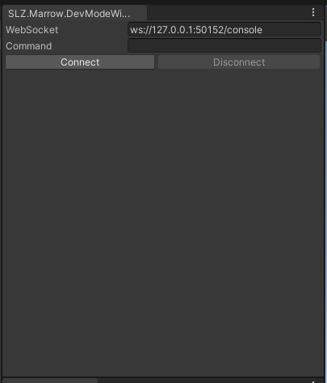

## Developer Mode

Developer Mode is a flag to enable functionality used by the MarrowSDK to interface with BONELAB. It enables a *local* WebSocket server, against which text commands can be issued. Enabling Developer Mode does *not* connect to an external server.

1. Enable Developer Mode from the in-game menu by selecting `Mods` -> `Settings`.
2. In a MarrowSDK Unity project select the `Stress Level Zero` -> `Void Tools` -> `DevMode` from the menu.



3. Verify the IP of the WebSocket (note that the WebSocket address must begin with ws://, not http or other protocol)
  * PCVR users: `ws://127.0.0.1:50152/console`
  * Quest users: `ws://[yourQuest2WifiIP]:50152/console` - Verify the IP using the `Quest2 WiFi Settings` -> `Advanced` within the headset or using the Meta phone app.
4. Click `Connect` in the MarrowSDK DevMode Window.




## DevMode Commands

The following commands are available to autoamte and streamline various modding processes (level reloading, pallet reloading, adding and removing mod repos, etc.) without having to restart Bonelab:

```
assetwarehouse.reload: Reload Pallet
aw.reload: Reload Pallet
help: Show console help
level.reload: Reload Current Level
repo.add: Add a mod repo
repo.del: Delete a mod repo
repo.delete: Delete a mod repo
repo.list: List mod repos
volume: Set/Get Volume settings: volume master|music|sfx #
```

* Note that Pallets still need to be repacked and have their folder contents copied into the `BONELAB\MODS` folder of the target platform before issuing a `aw.reload` command.

## Examples

Reload Pallet without restarting Bonelab

Once a Pallet has been packed and the mod folder has been copied into your `BONELAB\MODS` directory:
```
aw.reload
```

Add a Mod Repo to Bonelab
```
repo.add http://example.com/path/to/your/repository.json
```
