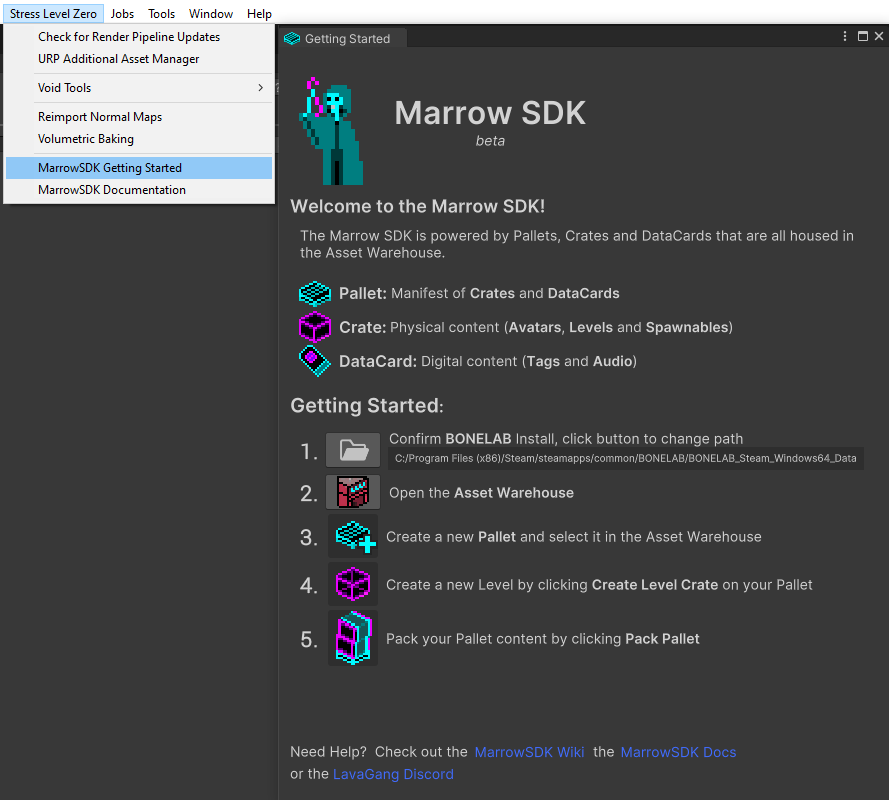

# MarrowSDK
欢迎来到MarrowSDK中文Wiki。这是一个包含中文翻译版MarrowSDK使用文档的公共资源站。
在浏览时记得关闭浏览器机翻，可能会破坏文档的排版。
## 创建Marrow内容
- [项目配置](ProjectSetup.md)
- [入门](#入门)
- [创建Pallet托盘、Crates板条箱、Datacards数据卡](PalletsAndCrates.md)
  - [生成物板条箱](Spawnables.md)——使用Bonelab生成物托盘生成原版Bonelab物品，在关卡中生成自制物品
  - [Avatar板条箱](Avatars.md)——创建和游玩自制Avatar
  - [关卡板条箱](Levels.md)——设计自制Bonelab关卡
  - [BoneTag数据卡](BoneTags.md)——用于引用玩家和其他物品或用于组织板条箱等的数字数据。
  - [MonoDisc数据卡](MonoDiscs.md)——引用数字音频数据
- [Zone区域](Zones.md)
  - [区域链接](ZoneLinks.md)
  - [区域事件](ZoneEvents.md)
  - [区域加载关卡](ZoneLoadLevel.md)
- [区域链接物品](ZoneLinkItems.md)
  - [区域音乐](ZoneMusic.md)
  - [区域环境音](ZoneAmbience.md)
- [托盘打包与模组安装](BuildPallet.md)
- [模组存储库](ModRepositories.md)
- [开发者模式](DeveloperMode.md)
- [UltEvents](UltEvents.md)
- [共享已打包内容](SharingPackedContent.md)

Project Setup
---
Watch the step-by-step <b>MarrowSDK [Project Setup Guide](https://www.youtube.com/watch?v=U5jynJcDjvo)</b>, the <b>[Getting Started Guide](https://www.youtube.com/watch?v=M4B0TOG-b94)</b> on YouTube or follow the written <b>[Project Setup](ProjectSetup.md)</b> guide.

入门
---

- On first launch, until you've created a Pallet, the editor will display a <i>Getting Started</i> window that will guide you through ensuring the SDK has <i>automatically</i> detected your game installation folder.  If not, the Game Install Locator will provide several options to find it.

- Setting your game install will add the External BONELAB Content Pallet, which gives you access to all Bonelab vanilla content, like spawnables, avatars, the full game soundtrack and several ambient sounds that can be used when making your own content.

- Use the Asset Warehouse button in the upper left of the Unity window to display the Asset Warehouse whenever you need it. 

- Create a Working Pallet, select it in the Asset Warehouse and add a new Level Crate.
- The Default Marrow Scene will create a basic template that includes the essential components of a level, so you can focus being creative!

