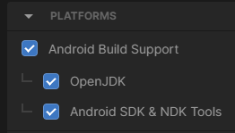
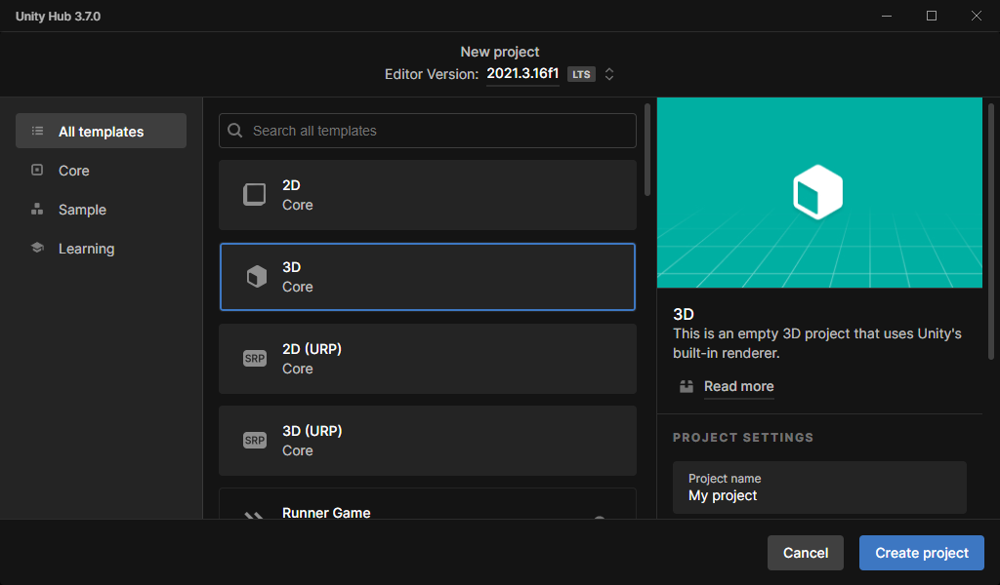
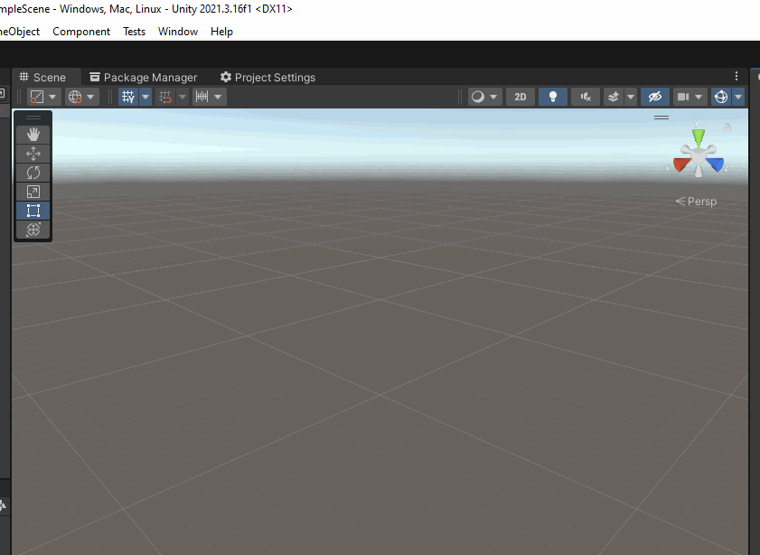
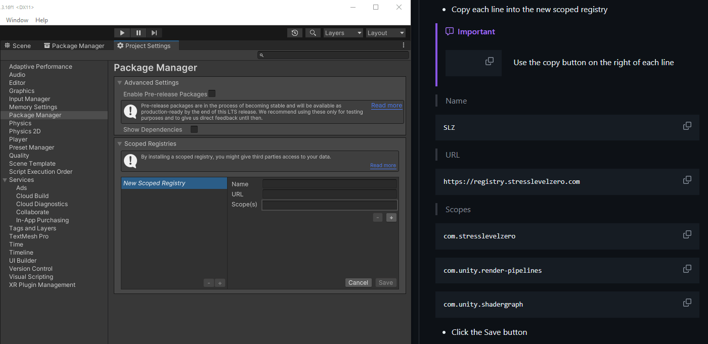
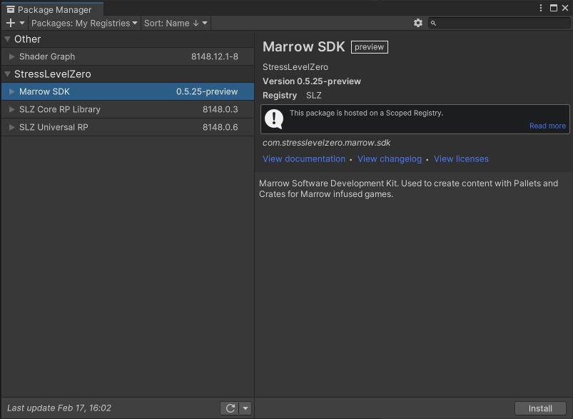

# 项目配置

<b>[返回MarrowSDKWiki主页](https://monogonasiaregion.github.io/MarrowSDK-zh/)</b>

要求
---
* Unity版本 `2021.3.16f1`
  * 只有与SLZ-URP兼容的着色器才能正常渲染
* 基础Unity知识

项目配置
---
在Youtube（需要网络环境）观看逐步<b>MarrowSDK[项目设置指南视频](https://www.youtube.com/watch?v=U5jynJcDjvo)</b>，和<b>[起始指南视频](https://www.youtube.com/watch?v=M4B0TOG-b94)</b>或按照下面的书面指南进行操作。


## 下载并安装Unity

- 下载[Unity Hub](https://unity.com/download). 
- （推荐做法）如果您已经安装了Unity Hub，您可以通过将以下unityhub链接复制到浏览器中来快速安装我们需要的Unity版本: `unityhub://2021.3.16f1`。推荐使用[Unity Hub](https://unity3d.com/get-unity/download)来帮助管理不同版本的Unity和多个项目。此外，[在此通过Unity归档页下载](https://unity3d.com/get-unity/download/archive)Unity `2021.3.16f`以供手动安装
- 安装Unity `2021.3.16f`时，请务必包含以下模块：在<b>平台（Platforms）</b>下，勾选*Android Build Support*及其子项目，*Android SDK & NDK Tools*和*OpenJDK*。在列表的下方，添加*Windows Build Support (IL2CPP)*。

 

- 安装Unity后，创建一个<b>新项目</b>。如果您有其他Unity编辑器版本，请务必从窗口顶部的列表中确定是选择`2021.3.16f`。


- 为您的模组创建一个新的`3D Core`项目。（或者3D Built-in Render Pipeline）（注意这一步与MarrowSDK老版本的此变化…<i><b>千万不要</b></i>选择3D URP)  

## 添加SLZ范围注册表

- 点进`Window（窗口）` → `Package Manager（包管理器）` → `齿轮图标` → `Advanced Project Settings（高级项目设置）`



#### 将每行复制到新的范围注册表中



> [!IMPORTANT]
>  使用每行右侧的复制按钮来避免打错

> Name
```
SLZ
```
> URL
```
https://registry.stresslevelzero.com
```
> Scopes
```
com.stresslevelzero
```
```
com.unity.render-pipelines
```
```
com.unity.shadergraph
```
- 点击Save保存关掉窗口

接下来，确定包管理器中`Packages: My Registries（我的注册表）`被选中然后点击<b>Stress Level Zero</b>菜单下的`Marrow SDK`。



- 点击安装。这将安装所有<b>Stress Level Zero</b>包。耐心等，下载可能需要一些时间。如果报错试试关闭代理或前往系统环境变量添加`HTTP_PROXY`和`HTTPS_PROXY`输入`http://你的电脑IP:代理端口`添加你的代理。

- 就是这样！不需要手动验证过程。

<b>[返回MarrowSDKWiki主页](https://monogonasiaregion.github.io/MarrowSDK-zh/)</b>
